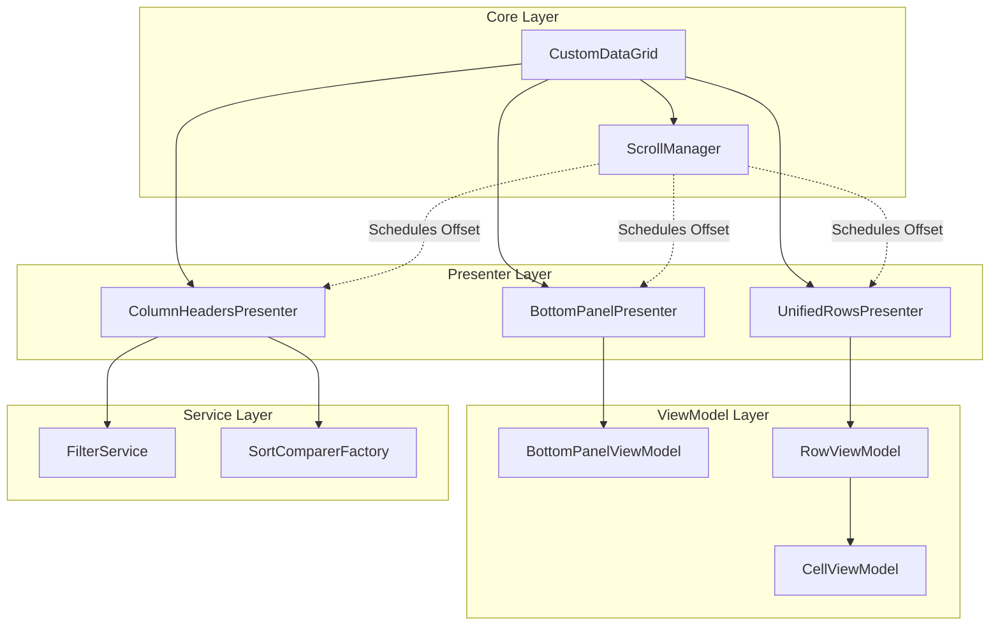

# Architecture: MaKroFlexGrid

Данный документ описывает высокоуровневую архитектуру контрола `MaKroFlexGrid` и взаимосвязи между его ключевыми компонентами.

## 🗺 Общая схема компонентов

## 🧩 Описание узлов

### Core Layer
- **CustomDataGrid**: Точка входа. Управляет общим состоянием, синхронизирует презентеры и предоставляет API для пользователя.
- **ScrollManager**: Координирует горизонтальное смещение. Гарантирует, что при скролле центральной части данные в `UnifiedRowsPresenter` и `BottomPanelPresenter` сдвигаются синхронно.

### Presenter Layer (Визуализация)
- **ColumnHeadersPresenter**: Отрисовывает многоуровневые заголовки. Управляет логикой Drag-and-Drop колонок и визуализацией индикаторов сортировки/фильтрации.
- **UnifiedRowsPresenter**: Реализует виртуализацию строк. Создает `RowContainer` и связывает их с соответствующими `RowViewModel`.
- **BottomPanelPresenter**: Отрисовывает строку итогов. Вычисляет агрегаты через рефлексию по `SortMemberPath`.

### ViewModel Layer (Состояние)
- **BottomPanelViewModel**: Хранит настройки оформления и данные итоговой панели.
- **RowViewModel**: Представляет одну строку данных. Содержит коллекцию `CellViewModel` для каждой колонки.
- **CellViewModel**: Хранит значение конкретной ячейки, её ширину и привязанный `DataTemplate`.

### Service Layer (Логика)
- **FilterService**: Управляет активными фильтрами для каждой колонки и применяет их к `ICollectionView` данных.
- **SortComparerFactory**: Предоставляет оптимизированные компараторы (`IComparer`) на основе типа данных (`SortDataType`), используя внутренний кеш для повышения производительности.

## 🔄 Потоки взаимодействия

### 1. Процесс отрисовки данных
`ItemsSource` $\rightarrow$ `UnifiedRowsPresenter` $\rightarrow$ создание `RowViewModel` $\rightarrow$ создание `CellViewModel` $\rightarrow$ выбор `DataTemplate` (Default или Custom).

### 2. Процесс фильтрации
Клик по заголовку $\rightarrow$ `FilterUIFactory` (создание UI) $\rightarrow$ `FilterService.SetFilter()` $\rightarrow$ `FilterService.ApplyFilters()` $\rightarrow$ Обновление `ICollectionView` $\rightarrow$ Перерисовка `UnifiedRowsPresenter`.

### 3. Процесс расчета агрегатов
Вызов `RefreshAggregates()` $\rightarrow$ `BottomPanelPresenter.UpdateAggregates()` $\rightarrow$ Рефлексивный обход `ItemsSource` $\rightarrow$ Применение формулы (Sum/Avg/etc) $\rightarrow$ Обновление `BottomCellViewModel`.
